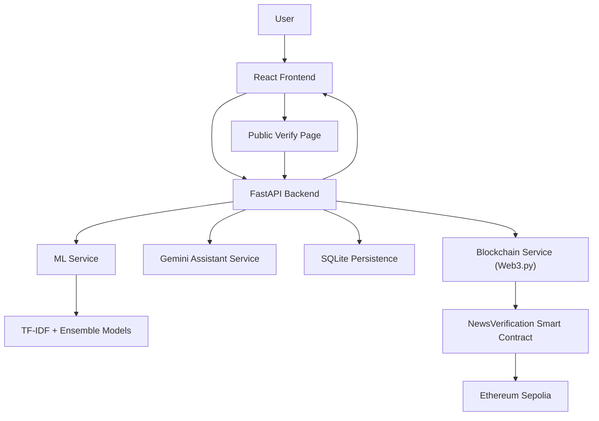

# Tez News: AI-Powered Fake News Detection and Verification Platform

## Project Report

### Submitted in partial fulfillment of the requirements for the award of a degree / project evaluation

**Submitted by:**  
`[Student Name]`  
`[Enrollment Number / Roll Number]`  
`[Section / Batch]`

**Submitted to:**  
`[Guide / Supervisor Name]`  
`[Designation]`

**Department:**  
`[Department Name]`

**Institution / Organization:**  
`[College / University / Company Name]`

**Academic Session / Duration:**  
`[Month Year - Month Year]`

**Date of Submission:**  
`[Date]`

---

# Certificate

This is to certify that the project report entitled **“Tez News: AI-Powered Fake News Detection and Verification Platform”** is a bona fide record of the work carried out by **`[Student Name]`** under my supervision and guidance. The work presented in this report is submitted in partial fulfillment of the requirements for the completion of the degree / project / internship program as prescribed by **`[Institution / Department Name]`**.

To the best of my knowledge, the work reported herein is original and has not been submitted, either in full or in part, to any other university, institution, or organization for the award of any other degree, diploma, or certification.

**Supervisor / Guide:**  
`[Name]`  
`[Designation]`  
`[Department / Organization]`

**Head of Department / Authorized Signatory:**  
`[Name]`  
`[Designation]`

**Date:** `[Date]`  
**Place:** `[Place]`

---

# Student Declaration

I hereby declare that the project titled **“Tez News: AI-Powered Fake News Detection and Verification Platform”** is my original work and has been carried out by me under appropriate guidance. I further declare that this report has not been submitted elsewhere for the award of any degree, diploma, certificate, or academic credit. Wherever references have been made to the work of others, due acknowledgement has been provided.

I understand that any form of plagiarism, misrepresentation, or false declaration shall render this submission invalid and may invite disciplinary action as per institutional norms.

**Student Name:** `[Name]`  
**Enrollment Number:** `[Enrollment Number]`  
**Signature:** `[Signature]`  
**Date:** `[Date]`

---

# Acknowledgement

I would like to express my sincere gratitude to my project guide, faculty mentors, and departmental staff for their continuous support, direction, and encouragement during the development of **Tez News**. Their technical guidance helped shape this project from an initial idea into a full-stack, deployment-ready application that addresses a socially significant problem: the spread of misinformation and fake news.

I am equally thankful to my institution for providing the academic environment, computing resources, and project platform necessary to carry out this work. The opportunity to combine software engineering, machine learning, explainable AI, and blockchain verification within a single practical system has been invaluable in strengthening both my technical understanding and project execution skills.

I also acknowledge the creators and maintainers of the open-source technologies, datasets, and documentation used in this project, including FastAPI, React, Tailwind CSS, scikit-learn, Web3.py, Solidity, Hardhat, and the LIAR dataset. Their contributions enabled rapid experimentation, modular implementation, and the building of a realistic end-to-end platform.

Finally, I am grateful to my family, peers, and well-wishers for their motivation and patience throughout the development and documentation process.

---

# Abstract

The rapid spread of misinformation through social media, short-form news formats, and digital content-sharing platforms has made fake news detection an important and challenging problem. Traditional manual verification processes are often slow, labor-intensive, and inaccessible to ordinary users who need quick credibility signals before sharing or trusting a claim. In response to this challenge, this project presents **Tez News**, an AI-powered fake news detection and verification platform designed as a full-stack system for classifying news content as likely **FAKE** or **REAL**, explaining the basis of the prediction, and optionally storing a tamper-evident verification proof on blockchain.

Tez News combines multiple technical layers into one integrated application. The frontend is developed using **React with Vite**, styled with **Tailwind CSS**, and designed around an **Inshorts-inspired vertical news feed** to provide a familiar and mobile-friendly experience. The backend is built using **FastAPI**, which exposes a structured API for authentication, prediction, analytics, blockchain storage, and record verification. The machine learning layer uses the **LIAR dataset** and implements a practical **TF-IDF-based classical ensemble** using **Logistic Regression**, **Naive Bayes**, and **Random Forest**. The project also includes an explainability mechanism that highlights important words contributing to the prediction and generates user-readable explanation text. To enhance interpretability, a **Gemini AI assistant** is integrated as a secondary analytical layer that provides a summary, suspicious signals, next verification steps, contradiction risk, and a second opinion. For trust anchoring and public auditability, a **Solidity smart contract** deployed on **Ethereum Sepolia** stores a hash of verified content along with result metadata such as confidence and timestamp.

The implemented system is not merely a prototype interface; it reflects practical engineering considerations such as **JWT-based authentication**, **SQLite persistence for users and analytics**, **production-safe environment validation**, **timeout handling for long AI or blockchain operations**, and **deployment preparation for Render and Vercel**. The project also addresses important methodological realities. In particular, it acknowledges that misinformation detection based purely on text classification does not guarantee factual truth and that extremely high benchmark-style accuracies are often unrealistic without grounded evidence retrieval.

The outcome of this work is a deployment-capable platform that demonstrates how machine learning, explainable AI, assisted verification, and blockchain-backed proof mechanisms can be combined to support trustworthy news evaluation. Tez News provides a strong foundation for future research and product development in evidence-grounded fact verification, credibility analysis, public trust systems, and misinformation resilience.

---

# Table of Contents

1. Introduction  
2. Literature Review, Existing System, and Problem Analysis  
3. Proposed System  
4. System Architecture  
5. Module Description  
6. Technology Stack Justification  
7. Machine Learning Methodology  
8. Blockchain Methodology  
9. API Design  
10. Frontend Design and User Flow  
11. Implementation Details  
12. Challenges Faced  
13. Solutions Implemented  
14. Testing and Validation  
15. Results and Outcomes  
16. Limitations  
17. Future Scope  
18. Conclusion  
19. References  
20. Resume / Portfolio Description  
21. Viva / Interview Explanation  
22. Elevator Pitch

---

# 1. Introduction

## 1.1 Background

The digital information ecosystem has transformed how people consume news. News is no longer accessed only through conventional newspapers, TV channels, or established editorial platforms. Instead, users increasingly rely on social media feeds, short-form content platforms, instant messaging, and user-generated news summaries. This shift has improved the speed and accessibility of information, but it has also intensified the challenge of misinformation. False or misleading claims can now spread rapidly, often faster than corrective reporting.

Fake news is not simply incorrect information. In a practical social context, it often refers to content that is fabricated, misleading, decontextualized, sensationalized, or framed in a way that causes the reader to infer something untrue. Because digital platforms prioritize engagement and virality, emotionally provocative and poorly verified content can outperform careful, nuanced reporting. This creates real risks in public health, elections, governance, finance, and social harmony.

As the volume of online content grows, manual verification becomes increasingly inadequate as the only defense mechanism. Users need tools that can quickly flag suspicious language, provide credibility signals, explain uncertainty, and help direct deeper fact-checking. At the same time, such tools must be honest about their limitations. A text classifier alone cannot establish truth with certainty; however, it can still be useful as an assistance layer when combined with explanation, AI guidance, and auditable verification mechanisms.

## 1.2 Problem Statement

The central problem addressed by this project is the lack of an integrated, user-friendly platform that can analyze a user-provided news statement or article, predict whether it is more likely to be fake or real, explain why that prediction was made, support user judgment with AI-generated verification guidance, and optionally create a publicly verifiable blockchain-backed proof of the analysis event.

## 1.3 Motivation

The motivation behind Tez News is both social and technical. Socially, misinformation has become one of the defining information challenges of the digital era. Users are frequently exposed to news snippets or claims without context, and many lack the time or skill to conduct structured verification. A system that can provide an immediate first-pass authenticity assessment can reduce careless sharing and encourage more responsible information behavior.

From a technical perspective, the project is motivated by the opportunity to combine multiple modern computing paradigms into a single meaningful application. The system brings together frontend engineering, API design, authentication, machine learning, explainable AI, assistant-based analysis, persistence, smart contracts, and deployment readiness. This makes the project a strong example of full-stack applied AI engineering.

## 1.4 Objectives

The primary objectives of Tez News are as follows:

1. To build a full-stack platform for fake news detection and verification.
2. To implement a machine learning-based prediction pipeline using the LIAR dataset.
3. To provide explainable outputs such as confidence, important words, and human-readable reasoning.
4. To integrate Gemini as an assistant layer for summarization and verification guidance.
5. To store authenticity proofs in the form of content hashes on Ethereum Sepolia.
6. To support public verification of stored blockchain-backed records.
7. To maintain user authentication, analytics tracking, and production-oriented persistence.
8. To design a clean, mobile-friendly interface for practical use.

## 1.5 Scope

The scope of this project includes text-based fake news classification, user interaction through a web frontend, secure backend APIs, blockchain storage of verification records, and analytics summarization. The current implementation focuses on binary classification of claims or article text into **FAKE** or **REAL** using a supervised learning approach trained on the LIAR dataset.

The project does not claim to deliver perfect fact verification or universal truth assessment. Rather, it provides a practical authenticity analysis workflow, combining classification with interpretability and optional proof storage. The scope also includes deployment preparation through Vercel and Render, making the system ready for real-world hosting with the appropriate environment configuration.

---

# 2. Literature Review, Existing System, and Problem Analysis

## 2.1 The Misinformation Problem

Misinformation is a complex socio-technical problem because it is influenced not only by factual correctness but also by framing, intent, timing, audience behavior, and platform mechanics. News consumers often encounter information in partial forms such as headlines, clipped screenshots, forwarded messages, or short summaries. These formats reduce context and make it easier for misleading content to appear credible.

Research in misinformation analysis shows that linguistic patterns can provide useful predictive signals. Sensational phrasing, extreme certainty, emotionally loaded wording, and missing source attribution may all correlate with lower credibility. However, such signals are probabilistic rather than deterministic. Credible reports can also use urgent language during crises, while misleading content can imitate formal journalistic style. This makes fake news detection a difficult classification problem rather than a straightforward rule-based task.

## 2.2 Existing Verification Approaches

Traditional verification methods rely heavily on manual processes. Professional fact-checkers consult primary sources, compare claims across trusted publications, inspect dates, identify image/video manipulation, and assess whether quoted statements are authentic and correctly contextualized. While highly valuable, such verification is resource-intensive and cannot scale to all the content ordinary users encounter daily.

Automated approaches can be grouped into several categories: rule-based systems, classical machine learning on textual features, deep learning or transformer-based classification, retrieval-based fact verification, and source credibility scoring systems. Rule-based systems are easy to implement but usually brittle. Deep learning systems can capture richer semantics but often require larger infrastructure and careful optimization. Retrieval-based systems are more promising for actual fact verification, but they depend on reliable evidence access and ranking.

## 2.3 Limitations of Traditional and Existing Systems

Many existing fake news tools suffer from one or more of the following limitations:

- they provide only a label without any explanation,
- they do not distinguish between prediction assistance and actual fact verification,
- they rely entirely on black-box outputs,
- they lack auditable or tamper-evident records,
- they provide weak user experience,
- they ignore deployment realities such as persistence, authentication, and service timeout behavior.

A major issue in this area is that classification tasks are often confused with truth verification. A model trained on datasets such as LIAR learns patterns associated with credibility labels, but it does not truly know facts in the world unless connected to external evidence. Therefore, any practical system must communicate uncertainty and encourage further verification instead of presenting classification as absolute truth.

## 2.4 Why AI + Explainability + Blockchain is Useful

The design rationale of Tez News is based on combining complementary strengths from different technologies. Machine learning offers rapid probabilistic classification from text patterns and metadata-aware features. Explainable AI improves user trust by surfacing important words, confidence values, and natural-language explanation. Gemini AI assistance adds an interpretive layer by summarizing the claim, noting suspicious signals, suggesting next verification steps, and offering a second opinion. Blockchain verification provides a tamper-evident public proof that a specific content hash was checked at a particular time with a recorded result and confidence.

Together, these layers create a more complete solution than any one layer could provide alone.

---

# 3. Proposed System

## 3.1 Overview of the Proposed Solution

Tez News is proposed as a full-stack fake news detection and verification platform that accepts a news claim or article-like text, runs it through a machine learning authenticity classifier, supplements the prediction with explainable outputs and Gemini-generated verification guidance, and optionally stores a verification proof on the Ethereum Sepolia test network. The platform is designed to balance usability, technical depth, transparency, and deployment practicality.

The application supports two main usage modes. In the first mode, a user simply checks whether a piece of news is likely fake or real. In the second mode, an authenticated user checks the content and stores its verification proof on blockchain so that the result can later be verified publicly through a hash-based lookup.

## 3.2 System Goals

The proposed system was designed with the goals of making fake-news analysis accessible, providing rapid results through a clean web interface, exposing interpretable model behavior rather than hiding it, supporting secure user-level workflows, maintaining a public verification trail, collecting useful analytics, and staying realistic about the limitations of text-based misinformation classification.

## 3.3 Improvements Over Traditional Approaches

Compared with traditional manual verification-only workflows, the proposed system reduces the time needed to obtain an initial credibility assessment. Compared with plain classifier demos, it improves user trust by exposing explanation, important words, and model breakdown. Compared with fully centralized systems, it adds a decentralized verification record through blockchain-backed storage. Compared with chatbot-only approaches, it uses Gemini as an assistant instead of the primary detector, preventing the system from relying entirely on generative responses for classification.

---

# 4. System Architecture

## 4.1 Architectural Overview

The system follows a layered architecture composed of a React frontend, a FastAPI backend, a machine learning inference layer, a Gemini assistant layer, blockchain integration through Web3.py, and SQLite-based persistence for authentication and analytics. Each layer has a clearly defined responsibility, making the codebase modular and easier to maintain.

At startup, the FastAPI application validates runtime configuration, initializes the SQLite database, and loads machine learning artifacts. The frontend communicates with backend APIs using Axios. Prediction requests are forwarded to the machine learning service, which constructs a metadata-aware input string, performs inference, and returns label, confidence, model breakdown, and important words. The backend then optionally enriches the result with Gemini analysis and records analytics. If the user chooses to store the result, the backend generates a content hash and submits it to the smart contract on Sepolia, returning the transaction hash immediately.

## 4.2 Major Architectural Layers

| Layer | Responsibility | Key Technologies |
|---|---|---|
| Presentation Layer | User interface, navigation, interaction, modal visualization, dashboard charts | React, Vite, Tailwind CSS, Framer Motion, Recharts |
| Application/API Layer | Routing, authentication, orchestration of prediction and storage workflows | FastAPI, JWT, Axios |
| ML Inference Layer | Authenticity prediction, TF-IDF vectorization, model ensemble, word importance extraction | scikit-learn, joblib, Python |
| AI Assistant Layer | Summary, suspicious cues, verification guidance, second opinion, optional grounding | Gemini API, httpx |
| Persistence Layer | Users and analytics storage | SQLite |
| Blockchain Layer | Hash storage, transaction metadata, public verification | Solidity, Hardhat, Web3.py, Ethereum Sepolia |

## 4.3 Text-Based Data Flow Explanation

The full data flow of Tez News can be described in the following sequence:

1. A user logs in or signs up through the frontend.
2. The frontend stores a JWT token and uses it for protected API calls.
3. The user selects a seeded story or submits custom news text.
4. The frontend calls `/predict` or `/predict-and-store`.
5. The backend preprocesses the input by combining article text with optional contextual metadata.
6. The machine learning service computes the authenticity prediction.
7. The backend generates explanation text from the important words.
8. If Gemini is enabled, the backend requests assistant analysis and merges it into the response.
9. The analytics service records label and important words for dashboard summaries.
10. If blockchain storage is requested, the backend hashes the content and writes the result metadata to the smart contract.
11. The frontend displays the result in a modal, including explanation, model breakdown, Gemini guidance, and blockchain proof details.
12. Later, any user can visit the public verification page and query `/verify/{hash}` to inspect the blockchain-backed record.

## 4.4 Mermaid Architecture Diagram



## 4.5 Runtime Behavior and Practical Engineering Considerations

The architecture is not limited to academic design diagrams; it reflects implementation realities. The backend includes lifespan-based initialization so that the database and model artifacts are ready at startup. The frontend maintains local session state using Context API and browser storage. Axios request interceptors attach tokens automatically and handle unauthorized responses centrally. Long-running prediction and store requests use extended timeouts because Gemini analysis and blockchain submission may take longer than standard API operations. The blockchain service is also designed with a fallback mock mode if required credentials are absent, which supports local development and testing.

---

# 5. Module Description

## 5.1 Authentication Module

The authentication module provides signup, login, session restoration, and protected route access. On the backend, user credentials are stored in SQLite and passwords are hashed using bcrypt-based logic through the security layer. Roles such as `admin`, `reporter`, and `user` are supported in the backend structure, even though the current UI exposes a common user flow.

On the frontend, authentication state is managed in `AuthContext`. When a user logs in or signs up, the JWT token is stored locally and decoded to hydrate user information. Protected routes such as feed, dashboard, submit, and profile are guarded using route wrappers, while the public verification page remains accessible without authentication.

## 5.2 Prediction Module

The prediction module is the operational core of the platform. The user’s input text is sent to the backend, where the ML service builds a richer input string by combining the main text with optional metadata such as subject, context, speaker, party affiliation, job title, and state information. This aligns inference behavior with the LIAR-style training setup.

The classifier returns the final label, confidence score, per-model breakdown, important words, and optional error information. This result is then formatted for frontend presentation and analytics recording.

## 5.3 Explainable AI Module

The explainability module helps translate model behavior into user-understandable output. Rather than leaving the decision as an opaque classifier score, the system extracts top TF-IDF words from the processed text and uses them as salient features. These words are highlighted in the UI and displayed separately as important terms.

The backend also synthesizes a short explanation message based on the predicted label and the important words. Although this explanation is template-based rather than a formal SHAP/LIME pipeline, it still significantly improves interpretability for end users and makes the model output easier to trust and challenge.

## 5.4 Gemini Assistant Module

The Gemini assistant module is deliberately positioned as an advisory layer. It is not used as the only detector and does not replace the ML classifier. Instead, it consumes the article text and classifier output and returns a structured JSON response containing summary, suspicious signals, verification guidance, contradiction risk, second opinion label, second opinion confidence, note on limitations, search queries, and grounded sources when grounding is available.

This design prevents over-reliance on a generative model for the primary classification task while still benefiting from Gemini’s strength in interpretation and guidance. The backend also handles service unavailability, quota exhaustion, unauthorized API behavior, and non-JSON responses gracefully by returning a fallback advisory object when necessary.

## 5.5 Blockchain Verification Module

The blockchain verification module enables storage of a verification proof using a Solidity smart contract deployed to Ethereum Sepolia. Instead of storing the raw article content on chain, the backend stores a generated hash of the input text along with result metadata. This reduces privacy and cost concerns while preserving a strong link between the checked content and the stored record.

The backend returns the transaction hash immediately after submission. If block confirmation is delayed, the response can still be shown to the user with a pending block number. This implementation choice is especially important on testnets like Sepolia, where confirmation timing may vary.

## 5.6 Analytics Dashboard Module

The analytics module collects lightweight aggregate statistics from prediction activity. The current implementation stores the label and important words of each prediction in SQLite. The dashboard then summarizes total checked items, fake count, real count, fake percentage, and top suspicious keywords.

In the frontend, these metrics are visualized using pie and bar charts. Empty states are also implemented so that first-time users receive meaningful guidance instead of blank screens.

## 5.7 Submit News Module

The submit news module allows users to enter a custom headline and article content. Basic validation checks ensure that the headline is present and the content is of reasonable length before analysis begins. After prediction, the submitted story can be added to the personalized feed, enabling a smooth loop between submission and review.

The same page supports two actions: check authenticity without storage, or verify and store on blockchain. This creates a clear separation between lightweight analysis and auditable proof generation.

## 5.8 Public Verification Module

The public verification module is accessible without authentication. A user can enter a content hash and query the blockchain-backed record through the backend verification endpoint. The UI displays the stored result, confidence, timestamp, and transaction hash. This module is important because it extends trust beyond logged-in users and supports public inspection of previously stored authenticity records.

---

# 6. Technology Stack Justification

## 6.1 Frontend Stack

**React with Vite** was chosen because it provides a fast development workflow, component-based architecture, and efficient state-driven rendering for interactive UIs. Vite offers fast startup and modern bundling suitable for a frontend project of this size.

**Tailwind CSS** was selected to enable rapid and consistent styling while preserving design flexibility. The project uses a custom visual direction rather than a default template, including dark mode, branded gradients, card layouts, and responsive behavior.

**Axios** was used for API communication due to its clean request/response abstractions, timeout support, and interceptors for JWT attachment and centralized error handling.

**React Router DOM** supports both public and protected routes. This is essential for separating login/signup flows from authenticated application views and from the public hash verification page.

**Context API** was used for app-level state such as session, history, feed items, prediction cache, toasts, and theme. For the current project scale, it provides sufficient centralized state management without the extra overhead of Redux or a more complex store.

**Framer Motion** improves user experience by adding smooth modal transitions and interface polish, making the platform feel more production-ready.

**Recharts** was chosen for dashboard analytics because it integrates naturally with React and makes it straightforward to build responsive chart components.

## 6.2 Backend Stack

**FastAPI** was selected because it is well suited for API-first applications, offers clear request/response modeling with Pydantic, and provides strong developer productivity. It is lightweight, modern, and especially appropriate for machine learning-backed services.

**JWT-based authentication** provides a stateless and scalable session model. It allows the backend to protect routes such as `/profile`, `/analytics`, and `/predict-and-store`.

**bcrypt password hashing** ensures that user credentials are not stored in plaintext and aligns with secure authentication practice.

**Python dotenv** simplifies environment-based configuration and keeps secrets outside code.

**Web3.py** was chosen for backend blockchain interaction because it integrates well with Python and allows contract calls, transaction signing, receipt handling, and event-aware workflows.

## 6.3 Machine Learning Stack

The live prediction pipeline uses **scikit-learn** with **TF-IDF**, **Logistic Regression**, **Multinomial Naive Bayes**, and **Random Forest**. These models were selected because they are practical, lightweight, easy to train, and deploy efficiently. Earlier architecture support also existed for **BiLSTM** and **DistilBERT**, but the current live system uses an improved classical ensemble because it offered a better balance of realism, speed, and deployment practicality.

## 6.4 Blockchain Stack

**Solidity** was chosen for smart contract development because it is the standard language for Ethereum-compatible contract programming.

**Hardhat** was used for compilation, testing, and deployment. It provides a productive workflow for contract development and deployment scripting.

**Ethereum Sepolia** was selected as the target network because it is a public Ethereum testnet suitable for development, demonstration, and low-risk deployment validation.

## 6.5 Persistence and Deployment Stack

**SQLite** was chosen for the current production-ready version because it is lightweight, easy to configure, and sufficient for small-scale deployments, demos, and academic submission projects. It supports users and analytics persistence without requiring a managed database service during early deployment stages.

**Render** was prepared for backend deployment, including persistent disk configuration for the SQLite database. **Vercel** was prepared for frontend hosting because it is a natural fit for static and Vite-based deployments.

---

# 7. Machine Learning Methodology

## 7.1 Dataset

The machine learning system is built using the **LIAR dataset**, a widely referenced dataset for short political claim verification research. It contains labeled statements and multiple metadata fields such as subject, speaker, context, job title, party affiliation, and state information.

For this project, the multi-class labeling of the original dataset was adapted into a binary authenticity task. The mapping used in the system is shown below.

| Original Label | Mapped Class |
|---|---|
| `false` | FAKE |
| `barely-true` | FAKE |
| `pants-fire` | FAKE |
| `mostly-true` | REAL |
| `true` | REAL |

The `half-true` class is excluded in preprocessing to keep the classification boundary cleaner and more aligned with the stated project objective of binary prediction.

## 7.2 Preprocessing

The preprocessing pipeline is more than simple text cleaning. It intentionally preserves part of the contextual richness of LIAR by combining the original statement with structured metadata fields. The training text is constructed using a metadata-aware template:

`statement + [SUBJECT] + [CONTEXT] + [SPEAKER] + [PARTY] + [ROLE] + [STATE]`

This is important because credibility cues often depend not only on what is said but also on who said it, in what context, and with what affiliation. After text assembly, the data is lowercased and cleaned to remove HTML, URLs, non-alphanumeric noise, and redundant whitespace.

## 7.3 Feature Extraction

The project uses **TF-IDF vectorization** with a configuration designed to capture both individual terms and short phrases. The key configuration choices include maximum features of 30,000, unigram and bigram support, minimum document frequency of 2, and sublinear term-frequency scaling.

## 7.4 Models Explored

The architecture initially supported multiple model families: Logistic Regression, Naive Bayes, Random Forest, BiLSTM, and DistilBERT. However, the final live deployment model emphasizes an improved classical ensemble. The deep learning and transformer components remain represented in the architecture and tests, but the practical deployment decision favored classical models because they were lighter, simpler to deploy, easier to retrain, and more predictable for this dataset/problem framing.

## 7.5 Ensemble Design

The system combines multiple classical model probabilities using weighted averaging. Validation-based optimization is used to search for weight combinations that maximize classification quality while avoiding unnecessarily large active model sets. This makes the ensemble more principled than a fixed equal-weight average.

The final inference server computes probability estimates from participating models and then produces the ensemble probability of the `REAL` class, the final label using a threshold, confidence recalculated relative to the predicted class, per-model label breakdown, and important TF-IDF words.

## 7.6 Explainability Approach

Explainability is handled through word importance extraction from the TF-IDF vector. The system identifies top-weighted terms in the transformed representation and treats them as important words. These words are returned in the API and highlighted in the frontend.

While this is not equivalent to full causal model interpretability, it provides a practical and understandable explanation signal for end users. This is especially appropriate in an application context where the goal is to make the system’s reasoning more transparent, not to present a mathematically complete interpretability framework.

## 7.7 Realism About Accuracy and Problem Difficulty

One of the important outcomes of the project is methodological honesty. Early expectations in fake news detection often assume that very high accuracy values such as 0.91 to 0.95 should be achievable through increasingly sophisticated models. However, in this project, it became clear that such performance is not realistically reliable for this setup without fundamentally changing the problem into evidence-grounded fact verification.

This is a crucial observation. LIAR-style classification captures patterns from labeled claims, but it does not solve general truth determination for arbitrary article text. The distinction between **linguistic plausibility** and **factual correctness** must be acknowledged. Therefore, the system is best understood as an authenticity assistance platform rather than an oracle of truth.

## 7.8 Why the Classical Ensemble Was Preferred in the Live System

The classical ensemble was ultimately favored because it offered a strong balance between reasonable predictive performance, low inference overhead, easier debugging, smaller deployment footprint, easier artifact management, and better suitability for a cloud-deployable student project.

This choice reflects engineering maturity. The best production decision is not always the most complex model; it is the one that delivers reliable value under real deployment constraints.

---

# 8. Blockchain Methodology

## 8.1 Why Blockchain Was Included

In credibility systems, trust is not created only by classification accuracy. Users also need confidence that a record of verification has not been silently altered later. Blockchain introduces a useful trust layer by making verification records externally inspectable and resistant to quiet modification.

Tez News uses blockchain not to store the entire article or to decentralize the entire platform, but to anchor the outcome of a verification event in a public ledger. This is a pragmatic use of blockchain that focuses on auditability rather than hype.

## 8.2 Why Only the Hash Is Stored On-Chain

The platform stores only the **content hash**, result, confidence, and timestamp on chain. Raw article text is not written to the blockchain. This design has several advantages:

- it preserves privacy better than storing full content,
- it reduces transaction cost and on-chain data load,
- it avoids permanently exposing sensitive or copyrighted content,
- it still allows deterministic verification of the exact checked content by recomputing the hash.

This approach is well aligned with the project’s verification purpose.

## 8.3 Smart Contract Design

The Solidity smart contract `NewsVerification` defines a `NewsRecord` structure containing `contentHash`, `result`, `confidence`, and `timestamp`. The contract exposes methods for adding a new news record and reading a stored record by hash. It also emits an event when a new record is added. A simple mapping from hash string to record is used for retrieval.

## 8.4 Backend Blockchain Flow

The backend blockchain service loads RPC configuration, private key, contract address, and contract ABI artifact. If the required configuration is present and the RPC connection succeeds, the service converts confidence into an integer representation, prepares a transaction for `addNewsRecord`, signs it using the configured account, submits the raw transaction, waits briefly for a receipt, and returns the transaction hash and block number if available.

If confirmation is slow, the system returns the transaction hash immediately and leaves the block number as pending. This avoids blocking the user experience unnecessarily.

## 8.5 Sepolia Deployment

Sepolia was chosen as the deployment network because it provides a realistic Ethereum-compatible environment without requiring mainnet gas cost. Hardhat scripts are used to compile and deploy the contract. Deployment metadata is stored in the project so the backend can be configured with the correct contract address and artifact path.

## 8.6 Public Verification Flow

When a user enters a hash in the public verification page, the frontend calls the backend `/verify/{hash}` endpoint. The backend then queries the contract and returns the stored content hash, result, confidence, timestamp, transaction hash if known, and block number if known. This gives the user a transparent way to confirm that a specific verification result was recorded.

---

# 9. API Design

## 9.1 Overview

The backend exposes a focused REST API that supports health monitoring, user authentication, profile access, prediction, analytics, and blockchain verification. The API design is intentionally compact and maps directly to the application’s main workflows.

## 9.2 Endpoint Summary

| Endpoint | Method | Purpose | Auth Required |
|---|---|---|---|
| `/health` | GET | Check backend availability | No |
| `/auth/signup` | POST | Create a new user and return token | No |
| `/auth/login` | POST | Authenticate user and return token | No |
| `/profile` | GET | Return current user profile | Yes |
| `/predict` | POST | Predict authenticity without blockchain storage | No |
| `/predict-and-store` | POST | Predict authenticity and store proof on blockchain | Yes |
| `/analytics` | GET | Return dashboard summary metrics | Yes |
| `/verify/{hash}` | GET | Retrieve blockchain-backed verification record | No |

## 9.3 Request Model Design

The prediction endpoints accept `text` as the primary field and also support optional contextual fields: `subject`, `context`, `speaker`, `party_affiliation`, `job_title`, and `state_info`. These fields mirror the metadata-aware design used in the training pipeline and make the API flexible for future extension.

## 9.4 Response Model Design

The prediction response includes `label`, `confidence`, `model_breakdown`, `important_words`, `explanation`, optional `ai_analysis`, and optional `error`. The store response extends this with `hash`, `txHash`, and `blockNumber`.

This response design is practical because it supports both UI rendering and downstream auditing without requiring multiple separate calls.

## 9.5 Security Considerations

Security measures implemented in the API layer include password hashing before storage, JWT generation and verification, protected dependency injection for current user access, secret key validation in production mode, CORS configuration using environment variables, and rejection of missing or invalid tokens for protected routes.

The backend also avoids starting in production with a default secret key, which is an important hardening measure.

## 9.6 Error Handling

Error handling is an important practical aspect of the API. The backend and frontend together handle invalid credentials, duplicate usernames, missing blockchain records, empty input text, Gemini quota or authorization failures, AI non-JSON responses, blockchain connection or confirmation delays, and timeout scenarios.

On the frontend, timeout-aware error normalization ensures that users receive understandable messages instead of raw exception traces.

---

# 10. Frontend Design and User Flow

## 10.1 Design Philosophy

The frontend is designed to feel modern, minimal, and mobile-friendly. Instead of presenting the application as a form-heavy dashboard from the outset, the project adopts an Inshorts-style vertical feed as the main interaction model. This choice is important because fake news often spreads through quick-consumption content formats, so the UI intentionally mirrors the environment in which users typically encounter fast-moving claims.

The interface also includes dark mode support, transitions, branding adjustments to the Tez News identity, modal-based result presentation, improved touch support, and clearer empty states.

## 10.2 Login and Signup Flow

Users begin at the login or signup page. Upon successful authentication, a JWT token is stored locally and decoded to restore the session. Route guards ensure that authenticated users are redirected into the application, while unauthenticated users are kept away from protected pages.

## 10.3 Feed Flow

After login, the user enters the main feed. Seeded articles and custom submitted stories are merged into a single content stream. Each article can be opened, verified, or verified and stored. Prediction results are cached locally by normalized text to reduce repeated API calls for the same content.

When the user verifies an item, the result modal displays the predicted label, confidence, explanation, important words, highlighted article text, model breakdown, and Gemini assistant analysis if available.

## 10.4 Verify and Store Flow

For authenticated users, the `Verify & Store` action initiates the prediction process and the blockchain storage workflow in one sequence. The result is shown in a dedicated blockchain modal that includes the prediction badge, transaction hash, verification ID, and block number or pending state. This separation between prediction modal and blockchain modal helps maintain clarity in the user experience.

## 10.5 Dashboard Flow

The dashboard fetches analytics only after authentication. It displays summary cards and visual charts. If no predictions have yet been recorded, the system renders user-friendly empty states that encourage the user to run a few checks rather than showing an empty analytics panel.

## 10.6 Public Verification Flow

The public verification page is available without login. It supports debounced lookup as the user types, while also providing a manual verify button. This makes public verification convenient and accessible. The result view displays stored metadata in a clean card-based layout.

## 10.7 Usability Enhancements

Several UI/UX improvements contribute to the overall quality of the project: mobile-friendly layout, touch support for card interactions, theme toggling, branded gradients and typography, smoother modal close behavior, loading and skeleton states, and toast notifications for success and error feedback.

These details are important because a technically strong project can still fail in practice if it feels difficult or confusing to use.

---

# 11. Implementation Details

## 11.1 Directory Structure Summary

The implementation is organized into clearly separated directories:

| Directory | Purpose |
|---|---|
| `frontend/` | React-based user interface |
| `backend/` | FastAPI backend, schemas, services, config, tests |
| `blockchain/` | Solidity contract, Hardhat config, deployment scripts, tests |
| `src/` | Core ML training/inference modules |
| `model_pipeline/` | Saved model artifacts |
| `tests/` | ML inference tests |
| `notebooks/` | Training and exploration notebook |

## 11.2 Important Backend Files

The backend is structured around a service-oriented layout:

- `app/main.py`: initializes FastAPI, CORS, lifespan startup behavior.
- `app/api/routes.py`: defines the main HTTP endpoints.
- `app/core/config.py`: environment-driven settings and production validation.
- `app/core/db.py`: SQLite connection and schema initialization.
- `app/core/security.py`: password hashing, token creation, and verification support.
- `app/services/ml_service.py`: wraps the ML model server and input construction.
- `app/services/ai_agent_service.py`: Gemini integration and structured fallback handling.
- `app/services/blockchain_service.py`: Web3 interaction and mock fallback mode.
- `app/services/analytics_service.py`: persistence-backed analytics aggregation.
- `app/services/user_service.py`: SQLite-backed user management.

## 11.3 Important Frontend Files

- `src/App.jsx`: route configuration.
- `src/context/AuthContext.jsx`: central application state and business logic bridge.
- `src/services/api.js`: Axios client and endpoint wrappers.
- `src/pages/Feed.jsx`: main feed workflow.
- `src/pages/SubmitNews.jsx`: custom claim submission.
- `src/pages/Dashboard.jsx`: analytics visualization.
- `src/pages/Verify.jsx`: public blockchain verification page.
- `src/components/modals/ResultModal.jsx`: detailed prediction visualization.
- `src/components/modals/BlockchainModal.jsx`: blockchain result visualization.

## 11.4 Important ML Files

- `train_pipeline.py`: training pipeline, artifact generation, ensemble weight optimization.
- `src/preprocess.py`: LIAR preprocessing, label mapping, metadata-aware text construction.
- `src/models.py`: classical and deep-learning model definitions.
- `src/ensemble.py`: weighted ensemble logic and optimization.
- `src/inference.py`: singleton inference server and prediction workflow.

## 11.5 How the Services Connect

The implementation follows a clear orchestration path:

1. frontend captures user action,
2. Axios sends request to backend,
3. routes call service layer functions,
4. ML service runs prediction,
5. AI service optionally enriches prediction,
6. analytics service records usage,
7. blockchain service stores proof if requested,
8. response returns to frontend,
9. frontend updates cache, history, and UI modals.

This division of responsibilities keeps business logic out of UI components and helps the project remain maintainable.

## 11.6 Production-Readiness Work

The project includes several implementation details that demonstrate production awareness:

- environment variable management,
- deployment config for Render and Vercel,
- persistent disk path for SQLite in Render,
- backend startup failure if production uses default secret key,
- long request timeout support for AI and blockchain operations,
- public verification route availability,
- graceful handling of pending Sepolia confirmations.

---

# 12. Challenges Faced

## 12.1 Low Accuracy in Proxy or Oversimplified Setups

One of the central challenges in the project was the gap between expected and realistic machine learning performance. It is easy to produce inflated expectations in fake news detection by oversimplifying the task, narrowing the dataset interpretation, or relying on proxy assumptions. During the project, it became clear that a reliable, generalizable 0.91-0.95 accuracy target was not realistic for this problem formulation and dataset configuration.

This challenge was not just technical but conceptual. It forced a reevaluation of what the platform should claim and how honestly it should represent model capability.

## 12.2 Inherent Difficulty of Misinformation Classification

Misinformation classification is intrinsically difficult because linguistic style is only an indirect proxy for truth. Some false claims are written persuasively and formally. Some true claims appear alarming or poorly written. Without retrieving and validating external evidence, the model can only estimate plausibility patterns learned from labeled examples.

## 12.3 Timeout Issues in AI and Blockchain Operations

Gemini analysis and blockchain transaction submission can both increase request latency. Waiting too long for these layers can degrade the user experience or cause frontend timeouts. Since the platform aims to feel interactive, managing these latencies became an important engineering challenge.

## 12.4 Sepolia Confirmation Delays

Sepolia is useful for deployment realism but does not always confirm transactions instantly. If the backend were to block until confirmation in every case, users would experience unnecessary waiting or failures. Handling this required careful design.

## 12.5 Keeping the UI Responsive

The application combines multiple result layers: model prediction, explanation, Gemini output, and blockchain metadata. Presenting all of this without overwhelming the user or freezing the interface required thoughtful component design and local caching.

## 12.6 Positioning Gemini Correctly

Another challenge was deciding how Gemini should be integrated. Using it as the sole classifier might have looked impressive but would have weakened methodological clarity and consistency. The project needed Gemini to add value without replacing the deterministic predictive layer.

## 12.7 Persistence Problems from In-Memory Storage

Early-stage app patterns often rely on in-memory storage for simplicity. However, for a report-worthy, deployment-capable platform, that is insufficient. User accounts and analytics must persist across restarts. This required a migration toward SQLite-backed storage and a more durable backend design.

## 12.8 Deployment Readiness and Secret Management

Making a local application deployment-ready introduces concerns such as secret storage, environment separation, database persistence paths, CORS, build settings, and cloud-specific configuration. Preparing these pieces required significant engineering effort beyond writing the core features.

---

# 13. Solutions Implemented

## 13.1 Full-Data Training and Improved Classical Pipeline

To improve model practicality, the training pipeline was refined to use stronger TF-IDF settings and full-data classical model training with validation-based ensemble tuning. This created a more stable live system than an overly ambitious but operationally fragile architecture.

## 13.2 Metadata-Aware Input Construction

The preprocessing and inference layers were aligned through metadata-aware text construction. Instead of feeding plain article text only, the system incorporates structured fields such as subject, speaker, context, role, and affiliation where available. This improves consistency between training and inference.

## 13.3 Honest Framing of ML Capability

A major solution was conceptual rather than algorithmic: the platform was positioned as an authenticity assistance system rather than a guaranteed truth engine. This allowed the design to remain useful while being scientifically honest.

## 13.4 Gemini Timeout and Failure Handling

The Gemini service includes timeout configuration, fallback behavior, structured unavailable responses, and specific messaging for quota exhaustion or authorization issues. This ensures that the main platform can continue functioning even if the AI assistant is unavailable.

## 13.5 Immediate Transaction Hash Return

Instead of forcing the user to wait for full Sepolia confirmation, the blockchain service returns the transaction hash immediately and populates the block number when available. This significantly improves responsiveness and reduces the likelihood of timeouts.

## 13.6 SQLite Persistence

SQLite was introduced for users and analytics. This transformed the system from a temporary-memory demo into a more realistic application with persistent records and deployment viability.

## 13.7 Environment Hardening

The backend now validates production secrets, supports configurable persistent database paths, and externalizes deployment-sensitive values through environment variables. Render and Vercel configuration files were also prepared.

## 13.8 Better UI Feedback

The frontend includes loading states, toasts, modals, empty-state guidance, dark mode, and client-side caching. These improvements make the system feel more polished and reduce confusion during longer operations.

---

# 14. Testing and Validation

## 14.1 Backend API Testing

The backend includes tests for health checks, prediction response structure, optional context field handling, signup/login flow, protected route access, analytics retrieval, and verification endpoint behavior. These tests validate the correctness of endpoint contracts and core backend workflows.

The tests also demonstrate that the system can be exercised in a controlled environment using mocked ML, AI, and blockchain outputs. This is useful because it isolates API logic from third-party variability during automated testing.

## 14.2 Frontend Verification

The frontend includes test files for authentication, public verification, and submit-news behavior. In addition to automated testing, the project structure and route layout support manual verification of end-to-end flows such as signup, login, feed-based verification, verify and store, analytics loading, and public hash verification.

Frontend build verification through Vite is also part of deployment readiness.

## 14.3 Machine Learning Validation

The machine learning pipeline includes validation-oriented ensemble tuning and inference tests that verify response format, presence of labels, confidence range, per-model breakdown, and important-word extraction. This is important for maintaining API consistency even when model artifacts are updated.

## 14.4 Blockchain Flow Verification

The blockchain layer is validated through service tests and deployment workflows. In environments without live chain configuration, the service falls back to mock record handling so development and testing can continue. In Sepolia-enabled environments, `/predict-and-store` returns a real transaction hash and `/verify/{hash}` retrieves stored data.

## 14.5 Gemini-Assisted Verification

The Gemini layer is tested structurally through mocked analysis objects and operationally through backend safeguards. Since Gemini behavior depends on API keys, quota, and access settings, the system is designed so that AI enrichment is optional rather than mandatory for a successful prediction response.

## 14.6 What Has Passed and What Remains Third-Party Dependent

The project is locally functional end to end and includes test coverage for core internal logic. However, the following behaviors remain dependent on external services:

- live Gemini generation quality and quota availability,
- live Google-grounded behavior through Gemini tools,
- live Sepolia transaction confirmation timing,
- public cloud deployment success depending on host configuration and secrets.

This separation between internally validated features and externally dependent features is important for honest evaluation.

---

# 15. Results and Outcomes

## 15.1 Functional Outcomes

The completed system can now authenticate users, display a branded vertical news feed, classify news content as FAKE or REAL, show confidence, model breakdown, important words, and explanation, generate Gemini-based verification assistance, store authenticity proofs on Ethereum Sepolia, verify stored records publicly using content hashes, present dashboard analytics on checked content, and accept user-submitted custom news for analysis.

## 15.2 Technical Outcomes

From a technical perspective, the project successfully integrates multiple domains into one application: frontend engineering, API-driven backend design, persistence, machine learning inference, explainable outputs, assistant AI, blockchain interaction, and deployment readiness.

This breadth is significant because the platform is not a disconnected set of demos. It is an integrated workflow where each layer supports the next.

## 15.3 User Value

The practical value of Tez News lies in helping users slow down before trusting or sharing a claim. It offers a fast authenticity signal, a clearer explanation of why the system produced that signal, and additional AI-assisted suggestions for what the user should verify next. For users who need a tamper-evident proof trail, it also offers blockchain-backed storage and public lookup.

## 15.4 Academic and Engineering Value

As a project submission, Tez News demonstrates sound software engineering practice, realistic AI system design, and thoughtful treatment of limitations. It is especially valuable as an example of how to combine applied machine learning with responsible framing and deployable system architecture.

---

# 16. Limitations

## 16.1 ML Prediction Is Not Equivalent to Truth

The most important limitation is conceptual: the classifier predicts likely authenticity based on patterns learned from labeled data. It does not prove truth. A `REAL` label does not certify factual correctness, and a `FAKE` label does not guarantee deception. The result must be interpreted as an aid to judgment, not a final verdict.

## 16.2 Dataset and Domain Generalization Limits

The LIAR dataset is useful but not universal. It is oriented around claim-style data and may not fully represent all modern misinformation forms, including multimodal disinformation, rapidly evolving narratives, satire, highly local context, or domain-specific propaganda.

## 16.3 Gemini Dependency

The assistant layer depends on external API access, billing, quota, and feature availability. Grounding behavior can vary depending on project permissions and provider-side limits. Therefore, Gemini enhances the system but should not be treated as always available.

## 16.4 SQLite Scalability Limits

SQLite is suitable for small-scale or academic deployments, but it is not ideal for high-concurrency, large-scale production systems. As usage grows, a migration to PostgreSQL or another managed relational database would be more appropriate.

## 16.5 Blockchain Confirmation Delays

Blockchain transactions, especially on testnets, are not always instantly finalized. Users may receive a transaction hash while the block number remains pending. This is a reasonable tradeoff for responsiveness, but it introduces temporary uncertainty in proof confirmation.

## 16.6 No Full Evidence Retrieval Yet

Although Gemini can provide guidance and may support grounded behavior depending on project access, the platform does not yet implement a dedicated retrieval-based fact verification engine with ranked evidence ingestion, source scoring, and claim-evidence reasoning.

---

# 17. Future Scope

## 17.1 Retrieval-Based Fact Verification

The most meaningful future enhancement is the introduction of a retrieval-based verification pipeline that fetches evidence from trusted sources and reasons over it explicitly. This would move the system from authenticity classification toward stronger fact verification.

## 17.2 Live Source Credibility Scoring

Future versions could evaluate the credibility of cited domains, publication patterns, and source histories. This would allow the platform to go beyond text signals and incorporate source reliability as part of the decision support process.

## 17.3 Migration to PostgreSQL

For larger or public deployment scenarios, migrating from SQLite to PostgreSQL would improve concurrency handling, reliability, and long-term maintainability.

## 17.4 Wallet-Based Authentication

Blockchain-aware user authentication through wallets could be introduced for advanced verification and decentralized identity workflows. This would be especially useful if the platform later evolves toward community moderation or distributed trust mechanisms.

## 17.5 Stronger Evidence-Grounded Models

Future machine learning work may include stronger hybrid models that combine retrieval, claim decomposition, source matching, contradiction detection, and calibrated uncertainty estimation.

## 17.6 Moderation and Review Workflows

The platform could be extended with reviewer dashboards, flagged content queues, admin moderation tools, and report-generation workflows for institutions or media organizations.

## 17.7 Real-Time News Ingestion

Another important enhancement would be automatic ingestion of news streams from APIs or RSS feeds, allowing Tez News to score and monitor live content at scale instead of relying only on manually entered or seeded stories.

## 17.8 Observability and Monitoring

For robust production operation, future work should include structured logging, error monitoring, analytics observability, latency dashboards, tracing, and alerting for AI and blockchain failures.

---

# 18. Conclusion

Tez News is a full-stack AI-powered fake news detection and verification platform developed to address a timely and socially significant challenge: the rapid spread of misinformation. The project demonstrates that a practical and meaningful authenticity assistance system can be built by combining frontend usability, backend structure, machine learning, explainability, assistant AI, and blockchain-backed proof storage into a coherent application.

The system achieves its core goals. It allows users to analyze claims or article-like text, receive a FAKE or REAL prediction with confidence and explanatory cues, obtain AI-assisted verification guidance, and optionally store a verification proof on Ethereum Sepolia for public lookup. It also includes user authentication, analytics persistence, deployment preparation, and a responsive user experience.

Equally important, the project does not overstate what the system can do. It recognizes that text classification is not the same as factual truth verification and that realistic misinformation analysis requires humility, transparency, and future evidence-grounded expansion. This honest positioning strengthens the academic and engineering quality of the project.

In conclusion, Tez News stands as a strong major-project implementation that is technically substantial, practically useful, and extensible for future research and product development in trustworthy information systems.

---

# 19. References

[1] W. Y. Wang, “Liar, Liar Pants on Fire: A New Benchmark Dataset for Fake News Detection,” *Proceedings of the 55th Annual Meeting of the Association for Computational Linguistics*, 2017.

[2] F. Pedregosa et al., “Scikit-learn: Machine Learning in Python,” *Journal of Machine Learning Research*, vol. 12, pp. 2825-2830, 2011.

[3] FastAPI, “FastAPI Documentation,” [Online]. Available: https://fastapi.tiangolo.com/

[4] React, “React Documentation,” [Online]. Available: https://react.dev/

[5] Vite, “Vite Documentation,” [Online]. Available: https://vite.dev/

[6] Tailwind CSS, “Tailwind CSS Documentation,” [Online]. Available: https://tailwindcss.com/docs

[7] Google AI, “Gemini API Documentation,” [Online]. Available: https://ai.google.dev/

[8] Ethereum Foundation, “Ethereum Developer Documentation,” [Online]. Available: https://ethereum.org/en/developers/

[9] Solidity Team, “Solidity Documentation,” [Online]. Available: https://docs.soliditylang.org/

[10] Hardhat, “Hardhat Documentation,” [Online]. Available: https://hardhat.org/docs

[11] Web3.py, “Web3.py Documentation,” [Online]. Available: https://web3py.readthedocs.io/

[12] J. Devlin, M. W. Chang, K. Lee, and K. Toutanova, “BERT: Pre-training of Deep Bidirectional Transformers for Language Understanding,” *NAACL-HLT*, 2019.

[13] S. Shu, A. Sliva, S. Wang, J. Tang, and H. Liu, “Fake News Detection on Social Media: A Data Mining Perspective,” *SIGKDD Explorations*, vol. 19, no. 1, 2017.

[14] Render, “Render Documentation,” [Online]. Available: https://render.com/docs

[15] Vercel, “Vercel Documentation,” [Online]. Available: https://vercel.com/docs

---

# 20. Resume / Project Portfolio Description

**Tez News: AI-Powered Fake News Detection and Verification Platform** is a full-stack web application developed using React, FastAPI, machine learning, Gemini AI, SQLite, and Ethereum Sepolia. The platform classifies news claims as FAKE or REAL, provides explainable outputs such as confidence and important keywords, generates AI-assisted verification guidance, and stores verification proofs on blockchain for public auditability. The project demonstrates skills in frontend engineering, REST API development, authentication, ML pipeline design, explainable AI, blockchain integration, testing, and cloud deployment preparation.

---

# 21. Viva / Interview Explanation

Tez News is a fake news detection and verification platform built as a layered full-stack system. The frontend is made using React and presents an Inshorts-style feed where users can check claims quickly. The backend is built with FastAPI and provides APIs for authentication, prediction, analytics, and verification. The machine learning model is trained on the LIAR dataset using a TF-IDF-based ensemble of Logistic Regression, Naive Bayes, and Random Forest. The result includes a label, confidence, important words, and explanation. Gemini is integrated as a secondary assistant that provides summary, suspicious cues, and what to verify next, but it is not used as the main classifier. If the user chooses, the backend hashes the content and stores the authenticity record on Ethereum Sepolia through a Solidity smart contract. The platform also includes SQLite persistence and deployment-ready configuration for Render and Vercel.

---

# 22. Elevator Pitch

Tez News is a full-stack AI-powered platform that helps users evaluate whether a news claim is likely fake or real. It combines machine learning classification, explainable AI, Gemini-based verification guidance, and blockchain-backed proof storage to make misinformation analysis faster, more transparent, and publicly verifiable.

---

# Appendix A: Representative API Payloads

## A.1 Predict Request

```json
{
  "text": "A viral claim says the city banned all electric scooters overnight.",
  "context": "Local governance update",
  "speaker": "Unknown social media post"
}
```

## A.2 Predict Response

```json
{
  "label": "FAKE",
  "confidence": 0.84,
  "model_breakdown": {
    "logistic": "FAKE",
    "naive_bayes": "FAKE",
    "random_forest": "REAL"
  },
  "important_words": ["viral", "banned", "overnight"],
  "explanation": "This article leans FAKE because the language pattern around viral, banned, overnight looks sensational or weakly grounded in verifiable evidence."
}
```

## A.3 Predict and Store Response

```json
{
  "label": "REAL",
  "confidence": 0.77,
  "hash": "f4b6b9f0d7f1...",
  "txHash": "0x1234567890abcdef1234567890abcdef12345678",
  "blockNumber": null
}
```

---

# Appendix B: Deployment Summary

| Component | Target Platform | Current Readiness |
|---|---|---|
| Frontend | Vercel | Config prepared |
| Backend | Render | Config prepared |
| Blockchain | Ethereum Sepolia | Contract deployment flow prepared and integrated |
| Persistence | SQLite | Implemented for current deployment-ready version |
| Future Database | PostgreSQL | Planned |

---

# Appendix C: Suggested Submission Formatting Notes

To match the attached academic format in Word or PDF form, this markdown report can be adapted as follows:

1. Use a centered title page with institution and department details.
2. Keep section headings numbered.
3. Use Times New Roman or a similar formal serif font in the final document.
4. Insert page numbers, certificate/declaration signatures, and institutional logo as required.
5. Convert the markdown tables and mermaid diagram into formatted Word tables and figures if the final submission requires a `.docx` layout.
